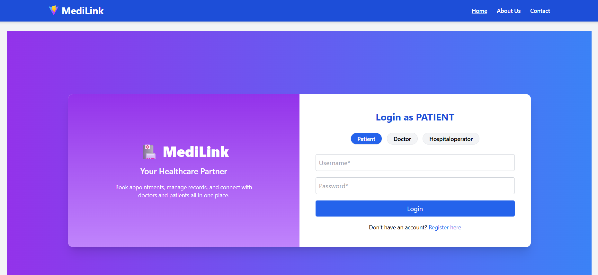

# ⚡ MediLink – Hospital Management System

> *“Connecting doctors, patients & operations seamlessly.”*

MediLink is a modern, full-stack **Hospital Management System (HMS)** built using a **microservices architecture**. It provides dedicated portals for **patients**, **doctors**, and **hospital operators**, and features powerful modules like **appointment management**, **medical billing**, **role-based login**, and **secure authentication** – all backed by a clean, modern UI using **ReactJS + TailwindCSS**.

---

## 🖼️ Project Preview

### 🔐 Frontend Login Page (Role-Based Authentication)



This is the login interface where users select their role (Patient, Doctor, Hospital Operator) before signing in. Registration, toast alerts, and error handling are all included.

---

## 🧰 Tech Stack

| Layer         | Technology Used |
|---------------|-----------------|
| Frontend      | ReactJS, TailwindCSS, Vite, Axios, Framer Motion |
| Backend       | Spring Boot, Spring Security, Spring Data JPA, Feign Clients, JWT |
| Service Discovery | Eureka Server |
| API Gateway   | Spring Cloud Gateway (WebFlux) |
| Database      | MySQL |
| Communication | Feign (Sync), Kafka (Planned for async) |
| Testing       | JUnit 5, Mockito |
| Dev Tools     | Postman, IntelliJ, VS Code, Git |

---

## 📂 Microservice Architecture

```
hospital-management-system/
├── authentication-service
├── doctor-service
├── patient-service
├── appointment-service
├── billing-service
├── api-gateway
├── eureka-server
└── frontend
```

Each service is independently deployable, registered with Eureka, and connected via Feign clients or Gateway routes.

---

## 🧑‍⚕️ Modules and Key Features

### 🔐 Authentication Module
- Email verification during registration
- JWT-based role authentication
- Secure login for Patient, Doctor, and HospitalOperator roles
- Synchronized creation of patients/doctors using Feign calls

### 👨‍💼 Patient Portal
- Book appointments with doctors
- View appointment history with filtering and export (CSV, Excel, PDF)
- View and pay bills
- Access only own data using secure JWT userId extraction

### 👩‍⚕️ Doctor Portal
- View all appointments scheduled with the logged-in doctor
- Modify appointment status
- Server-side filtering, sorting, and pagination

### 🏢 Hospital Operator Dashboard
- Central dashboard for managing all appointments, patients, and doctors
- Update appointment statuses or delete them
- Export data for offline analysis (CSV, Excel, PDF)
- Responsive layout with side navigation

### 💳 Billing Module
- Create bills for appointments with automatic patient/doctor name validation via Feign
- Store doctorName and patientName directly in the Bill entity
- View bills by patientId or doctorId
- Status update (e.g., `PENDING` → `PAID`)

---

## 📦 Setup & Installation

### ✅ Prerequisites

- Java 17+
- Node.js (v18+)
- MySQL 8+
- Maven
- Git

---

### 🛠️ Backend Setup

```bash
# Clone the repository
git clone https://github.com/Harmanjitsinghmultani/hospital-management-system.git
cd medilink-hospital-management
```

Start Eureka Server first:
```bash
cd eureka-server
mvn spring-boot:run
```

Then start all services one-by-one:
```bash
cd authentication-service && mvn spring-boot:run
cd doctor-service && mvn spring-boot:run
cd patient-service && mvn spring-boot:run
cd appointment-service && mvn spring-boot:run
cd billing-service && mvn spring-boot:run
cd api-gateway && mvn spring-boot:run
```

Ensure MySQL databases are created:
- `auth_db`
- `patient_db`
- `doctor_db`
- `appointment_db`
- `hospitaldb` (for billing)

Update database credentials in `application.properties` of each service.

---

### 💻 Frontend Setup

```bash
cd frontend
npm install
npm run dev
```

Open the app in browser:
```
http://localhost:5173
```

---

## 🧪 Testing

Run JUnit tests in backend services:
```bash
mvn clean test
```

Each module includes service-level and controller-level tests using **Mockito**.

---

## 📈 Future Roadmap

- [ ] Docker Compose integration for entire system
- [ ] Kafka for asynchronous event handling
- [ ] Admin dashboard with analytics
- [ ] Notification system (email/SMS)
- [ ] Dark mode support for UI

---

## 🤝 Contribution

Pull requests are welcome. For major changes, please open an issue first to discuss what you would like to change.

---

## 📄 License

This project is licensed under the MIT License.

---

## 👤 Author

**Harman**  
GitHub: [@Harmanjitsinghmultani](https://github.com/Harmanjitsinghmultani)  
Email: harmanjeet.multani88@gmail.com
